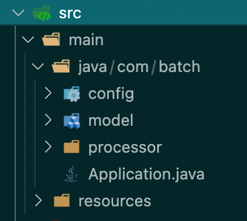

# Spring Batch Rapid Starter

#### A template for quickly building spring batch based jobs

### Packages

The starter is divided into the following packages:

#### How does the starter work?

`com.snimma1.app.Application` is the main class of the application, as in a normal spring boot app.

Configuration classes for necessary batch components are scanned via Spring accordingly/

`com.snimma1.config.*` contains classes that configure jobs,steps and tasks:

* `db` contains datasource configuration. This could be a JDBC connection, MongoDB, etc
* `readers` contains configuration and custom reader instantiations 
* `writers` contains configuration and custom writer instantiations
* `batch` configures the overall batch processing job

`com.snimma1.model` contains model classes

`com.snimma1.processor` contains processor implementations

`com.snimma1.notification` contains custom listeners

